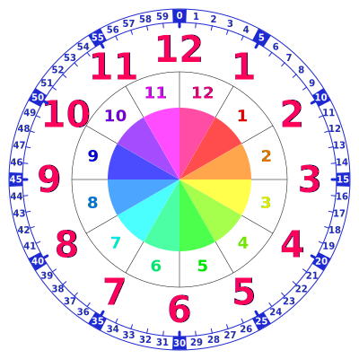

# ClockFaceForChildren
Teaching children how to read a clock. [SVG](img/clock.svg), [PDF](img/clock.pdf), [PNG](img/clock.png).

## License
CC0.

`MakeSVG/` has reference to Svg.Core which is licensed under MSPL. So be careful.
